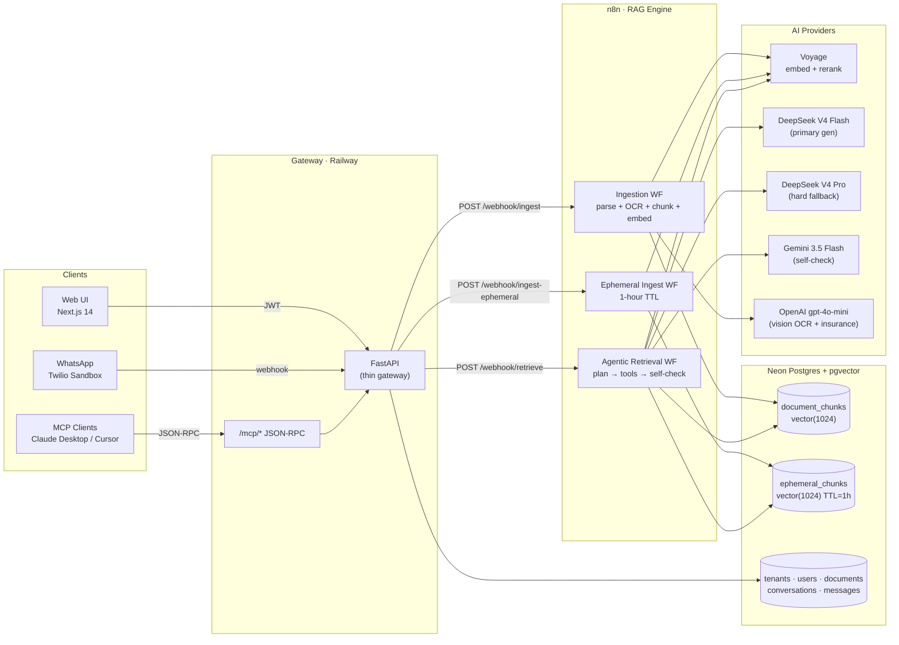
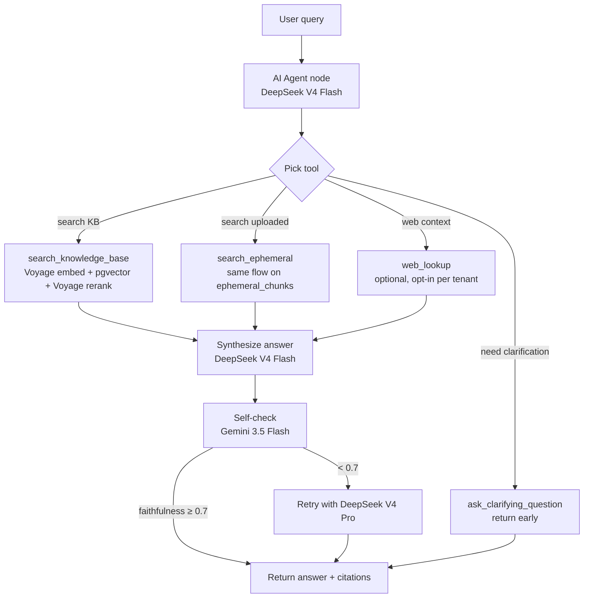

# ARCHITECTURE.md — IISc Grounded Agentic RAG Platform

> Two-path retrieval. Agentic loop in n8n. Multi-tenant. Cited answers only.

---

## 1. High-Level System



**Principle**: FastAPI is a thin gateway. **All** AI logic (embed, retrieve, rerank, generate, self-check) lives inside n8n.

---

## 2. Two Upload Paths

```mermaid
flowchart TB
    subgraph Admin["Admin Persistent Upload"]
        A1[Admin uploads PDF<br/>≤ 25 MB] --> A2[POST /admin/documents/upload]
        A2 --> A3[FastAPI: validate MIME + magic bytes<br/>+ tenant quota check]
        A3 --> A4[Save to /uploads]
        A4 --> A5[Trigger n8n /webhook/ingest]
        A5 --> A6[Chunks land in<br/>document_chunks]
        A6 --> A7[Available to ALL users<br/>in tenant FOREVER]
    end

    subgraph Chat["WhatsApp Ephemeral Upload (Pattern A)"]
        B1[User sends PDF in WhatsApp<br/>≤ 10 MB] --> B2[Twilio webhook → FastAPI]
        B2 --> B3[Validate + save to /tmp]
        B3 --> B4[Trigger n8n /webhook/ingest-ephemeral]
        B4 --> B5[Chunks land in<br/>ephemeral_chunks<br/>expires_at = NOW + 1h]
        B5 --> B6[Scoped to ONE conversation<br/>auto-purged hourly cron]
    end
```



| Aspect              | Admin Upload                 | WhatsApp Upload                   |
| ------------------- | ---------------------------- | --------------------------------- |
| Max size            | 25 MB                        | 10 MB                             |
| Persistence         | Forever (`document_chunks`)  | 1 hour (`ephemeral_chunks`)       |
| Scope               | All users in tenant          | Single conversation only          |
| Cleanup             | Manual delete via UI         | Hourly cron: `cleanup_ephemeral.py` |
| Counts toward quota | Yes (1 GB/tenant)            | No                                |

---

## 3. Agentic Retrieval Loop (n8n)



**Faithfulness score** is returned with every answer and stored on `chat_messages.faithfulness`. The UI shades the badge red/yellow/green.

---

## 4. Component Map

### FastAPI Gateway (`backend/`)
- **Does**: auth (JWT), file upload validation, webhook receipt, DB CRUD, MCP server, rate-limit (slowapi, in-process)
- **Does NOT**: call LLMs, embed text, chunk documents
- **Key files**: `app/main.py`, `app/api/`, `app/services/file_validator.py`, `app/mcp/`

### n8n RAG Engine (`n8n-workflows/`)
- **Ingestion** (`ingestion-pipeline.json`) — parse → OCR (scanned PDFs via gpt-4o vision) → chunk → Voyage embed → INSERT into `document_chunks`
- **Agentic retrieval** (`retrieval-pipeline.json`) — AI Agent node with 4 tools, Voyage rerank, Gemini self-check
- **Ephemeral ingest** (`ingest-ephemeral.json`) — same as ingestion but writes to `ephemeral_chunks` with TTL

### Neon Postgres + pgvector
- 1024-dim vectors (Voyage `voyage-4-large`)
- HNSW index on both vector tables (m=16, ef_construction=64)
- Every query is `WHERE tenant_id = :tenant_id` — enforced by `get_current_tenant()`

### MCP Server (`backend/app/mcp/`)
- `GET /mcp/info` — server discovery (no auth)
- `POST /mcp/rpc` — JSON-RPC (`tools/list`, `tools/call`)
- Auth: `X-MCP-API-Key` header
- Tools: `query_knowledge_base`, `list_documents`

### Channels
- **Web** — Next.js admin + chat UI (Vercel)
- **WhatsApp** — Twilio Sandbox; phone → tenant via `whatsapp_tenant_map`
- **MCP** — Claude Desktop / Cursor (see `docs/DEMO.md` for config)
- **Slack** — stretch goal

---

## 5. Hosting Targets

| Layer            | Provider              | Cost                            |
| ---------------- | --------------------- | ------------------------------- |
| Frontend         | Vercel (Hobby)        | Free                            |
| Backend + n8n    | Railway               | ~$5/mo (single project)         |
| Postgres+pgvector| Neon                  | Free (10 GB storage)            |
| Embeddings       | Voyage                | Free (200M tokens)              |
| Rerank           | Voyage                | Free (200M tokens)              |
| Generation       | DeepSeek V4 Flash     | ~$0 (cheap pay-as-you-go)       |
| Self-check       | Gemini 3.5 Flash      | Free tier                       |
| Hard fallback    | DeepSeek V4 Pro       | ~$5 one-time (promo by 31 May)  |
| Insurance        | OpenAI                | $5 prepaid (hard cap $10)       |
| **Total**        |                       | **~$10 one-time + ~$5/mo**      |

No Redis. JWT is stateless; rate-limit is in-process slowapi.

---

## 6. Webhook Contracts

### POST `/webhook/ingest` (FastAPI → n8n)
```json
{
  "document_id": "uuid",
  "tenant_id": "uuid",
  "file_path": "/uploads/filename.pdf",
  "source_type": "pdf",
  "title": "Document title",
  "callback_token": "<settings.N8N_CALLBACK_TOKEN>"
}
```

### POST `/webhook/ingest-ephemeral` (FastAPI → n8n)
```json
{
  "conversation_id": "uuid",
  "tenant_id": "uuid",
  "file_path": "/tmp/whatsapp-xxx.pdf",
  "source_name": "user-upload.pdf",
  "ttl_seconds": 3600
}
```

### POST `/webhook/retrieve` (FastAPI → n8n)
```json
{
  "query": "How do I reset the device?",
  "tenant_id": "uuid",
  "conversation_id": "uuid",
  "conversation_history": [...],
  "max_chunks": 5,
  "include_ephemeral": true
}
```
Response:
```json
{
  "answer": "To reset the device... [Manual, p.12]",
  "sources": [{"document_id": "uuid", "title": "Manual", "chunk_text": "...", "page_number": 12, "score": 0.94}],
  "follow_up_questions": ["...", "...", "..."],
  "faithfulness": 0.92,
  "requires_clarification": false,
  "metadata": {"model": "deepseek-v4-flash", "retrieval_time_ms": 1100, "chunks_retrieved": 5}
}
```

### POST `/webhooks/n8n/ingestion-status` (n8n → FastAPI)
```json
{
  "document_id": "uuid",
  "status": "completed" | "failed",
  "chunk_count": 42,
  "error_message": null,
  "callback_token": "<settings.N8N_CALLBACK_TOKEN>"
}
```

---

## 7. Security

- JWT (stateless, 24h expiry). No Redis blacklist.
- File uploads: size cap + MIME allowlist + **magic-byte verification** (defense-in-depth) in `services/file_validator.py`.
- Per-tenant 1 GB storage cap (enforced in upload handler).
- 20 uploads/hour/tenant (`slowapi` rate limit).
- Twilio signature validated on every WhatsApp webhook.
- n8n callbacks authenticated via shared `N8N_CALLBACK_TOKEN`.
- MCP RPC: `X-MCP-API-Key` header required in production.
- Every DB query filters by `tenant_id` — enforced by SQLAlchemy dependency.
- OpenAI hard cap $10 (rejects new requests if cost exceeds).

---

## 8. Diagram Sources

Editable diagram sources for the team live in [docs/diagrams/](docs/diagrams/):
- `system-overview.excalidraw` — hand-drawn high-level system
- `agentic-loop.excalidraw` — retrieval agent loop
- `two-upload-paths.excalidraw` — admin vs WhatsApp upload paths

Open with the **Excalidraw VS Code extension** (already installed). Mermaid diagrams above render natively on GitHub — keep them in sync if you change Excalidraw sources.
