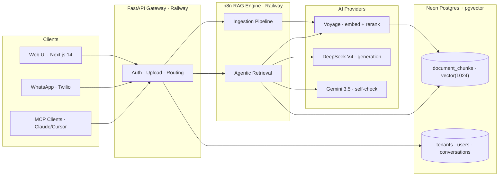

<div align="center">

# IISc Grounded Agentic RAG Platform

**Multi-tenant SaaS platform for grounded, citation-backed Q&A across Web, WhatsApp, and Slack.**

Upload your documents. Ask questions. Get answers grounded in your sources — never hallucinated.

[](https://github.com/iisconline2025-AI/rag-platform/actions)
[](https://rag-platform-production.up.railway.app/docs)
[](https://iisconline2025-AI.github.io/rag-platform/)
[](https://fastapi.tiangolo.com)
[](https://nextjs.org)
[](https://n8n.io)
[](https://python.org)
[](LICENSE)

[Live API](https://rag-platform-production.up.railway.app/docs) · [Documentation](https://iisconline2025-AI.github.io/rag-platform/) · [Architecture](ARCHITECTURE.md) · [API Spec](specs/openapi.yaml)

</div>

---

## Why This Platform?

Businesses onboarding customers face the same support queries over and over — questions already answered in their manuals, SOPs, and FAQs. This platform lets any business upload their knowledge base once and offer **instant, grounded Q&A** to customers across multiple channels.

### Key Differentiators

- **Grounded answers only** — every response cites the source document, page number, and exact chunk. No hallucinations.
- **Multi-tenant isolation** — Tenant A's documents are never visible to Tenant B. Enforced at the database level.
- **Multi-channel delivery** — same knowledge base served via Web UI, WhatsApp (Twilio), and Slack.
- **Agentic retrieval** — n8n-powered agent loop with tool selection, Voyage reranking, and Gemini self-check.
- **Ephemeral uploads** — WhatsApp users can send a PDF and ask questions about it instantly (auto-purged in 1 hour).

---

## Architecture



> FastAPI is a **thin gateway** — all AI logic (embed, retrieve, rerank, generate, self-check) runs inside n8n workflows.

See **[ARCHITECTURE.md](ARCHITECTURE.md)** for detailed data flows, webhook contracts, and security model.

---

## Tech Stack

| Layer | Technology | Purpose |
|:------|:-----------|:--------|
| **Frontend** | Next.js 14, TailwindCSS, TypeScript | Admin portal + Chat UI |
| **Backend** | FastAPI, SQLAlchemy (async), Pydantic v2 | API gateway, auth, file validation |
| **RAG Engine** | n8n (self-hosted) | Ingestion, agentic retrieval, self-check |
| **Database** | PostgreSQL 17 + pgvector (Neon) | Vectors, metadata, multi-tenant isolation |
| **Embeddings** | Voyage `voyage-4-large` (1024 dims) | Document + query embedding |
| **Reranker** | Voyage `rerank-2.5` | Re-score retrieved chunks |
| **Generation** | DeepSeek V4 Flash / Pro | Answer synthesis |
| **Self-check** | Gemini 3.5 Flash | Faithfulness verification |
| **Vision OCR** | OpenAI `gpt-4o` | Scanned PDF text extraction |
| **WhatsApp** | Twilio Sandbox | Bot channel |
| **Hosting** | Railway (backend/n8n), Vercel (frontend), Neon (DB) | ~$10 one-time + ~$5/mo |

---

## Features

### Document Ingestion
- Upload **PDF, DOCX, TXT**, or provide a **URL** to scrape
- Automatic text extraction (OCR for scanned PDFs via GPT-4o vision)
- Chunking (512 tokens, 50-token overlap) → Voyage embedding → pgvector storage
- Status tracking: `pending → processing → completed / failed`

> ⚠️ *Upload handler is scaffolded (501 stub). File validator and n8n client are implemented. M3 to wire together.*

### Grounded Q&A with Citations
- Every answer cites **document title + page number + exact source chunk**
- Faithfulness score (0.0–1.0) returned with every response
- Self-check via Gemini — answers below threshold are auto-retried with a stronger model
- 3 follow-up questions generated per response

> ⚠️ *Mock mode (`MOCK_N8N=true`) returns canned responses. Real n8n retrieval integration pending M3 + M6.*

### Multi-Channel Delivery
- **Web Chat** — full UI with citations panel, conversation history, follow-up chips ⚠️ *Chat UI not started (M9). Admin UI in progress (M8).*
- **WhatsApp** — text answer with citation references via Twilio ⚠️ *Stub handler only (M4/M12).*
- **MCP** — Claude Desktop / Cursor can query via JSON-RPC tools ✅ *Implemented.*
- **Slack** — `@mention` replies in threads ⚠️ *Stub handler only (M4). Stretch goal.*

### Admin & Tenant Management
- Self-service tenant onboarding wizard ⚠️ *Stub (M13).*
- Document management dashboard ⚠️ *Admin UI scaffolded with mock data (M8 branch). Backend stubs (M3).*
- User management with role-based access (super_admin / admin / user) ✅ *Auth + RBAC implemented (M2).*
- Per-tenant 1 GB storage quota ⚠️ *Config exists, enforcement pending upload handler.*

### Evaluation Framework (RAGAS)
- 30 curated Q&A pairs across 12 application domains ✅ *Dataset + harness in `codex/evaluation` branch.*
- Automated metrics: faithfulness, answer relevancy, context precision, context recall
- Multi-tenant isolation verification tests
- Load testing with Locust ⚠️ *Stretch goal, not yet started.*

---

## Quick Start

### Prerequisites
- Docker & Docker Compose
- Python 3.11+
- Node.js 18+ (for frontend)

### Local Development

```bash
# 1. Clone and configure
git clone https://github.com/iisconline2025-AI/rag-platform.git
cd rag-platform
cp .env.example .env          # fill in your API keys (see docs/DEPLOYMENT.md)

# 2. Start infrastructure
docker compose up -d           # postgres + pgvector, n8n

# 3. Backend
cd backend
pip install -r requirements.txt
alembic upgrade head           # apply database migrations
python -m app.scripts.seed_admin  # seed demo tenant + admin user
uvicorn app.main:app --reload --port 8000

# 4. Frontend (separate terminal)
cd frontend
npm install
npm run dev
```

### Verify

| Service | URL |
|:--------|:----|
| API docs (Swagger) | http://localhost:8000/docs |
| Health check | http://localhost:8000/health |
| n8n workflows | http://localhost:5678 |
| Frontend | http://localhost:3000 |

### Deployed Instances

| Service | URL |
|:--------|:----|
| Backend API | https://rag-platform-production.up.railway.app/docs |
| n8n | https://n8n-production-c637.up.railway.app/ |

---

## Project Structure

```
rag-platform/
├── backend/
│   ├── app/
│   │   ├── api/            # Route handlers (auth, admin, chat, webhooks, onboarding)
│   │   ├── bots/           # WhatsApp + Slack bot logic
│   │   ├── core/           # Config, database, security, dependencies, rate limiting
│   │   ├── mcp/            # MCP JSON-RPC server for AI client integration
│   │   ├── models/         # SQLAlchemy ORM models
│   │   ├── schemas/        # Pydantic request/response schemas
│   │   ├── services/       # n8n client, file validator
│   │   └── main.py         # FastAPI application entry point
│   ├── alembic/            # Database migrations
│   └── requirements.txt
├── frontend/               # Next.js 14 admin + chat UI
├── n8n-workflows/          # Exportable n8n pipeline JSONs
│   ├── ingestion-pipeline.json
│   ├── retrieval-pipeline.json
│   └── ingest-ephemeral.json
├── evaluation/             # RAGAS evaluation framework + sample data
├── database/
│   └── init.sql            # PostgreSQL schema bootstrap
├── docs/                   # Sphinx source + deployment/demo guides
├── specs/
│   ├── openapi.yaml        # Full API contract
│   └── MODULE_SPEC_M*.md   # Per-member module specifications
├── tests/                  # pytest integration tests
├── docker-compose.yml
└── .github/workflows/      # CI/CD (lint, test, build, docs)
```

---

## API Overview

All endpoints are documented in the interactive **[Swagger UI](https://rag-platform-production.up.railway.app/docs)** and defined in [`specs/openapi.yaml`](specs/openapi.yaml).

| Endpoint | Method | Description |
|:---------|:-------|:------------|
| `/auth/login` | POST | Authenticate and receive JWT |
| `/auth/register` | POST | Create user (admin only) |
| `/auth/me` | GET | Current user profile |
| `/admin/documents/upload` | POST | Upload document for ingestion |
| `/admin/documents` | GET | List tenant documents |
| `/chat/query` | POST | Ask a question → grounded answer |
| `/chat/conversations` | GET | List conversation history |
| `/webhooks/whatsapp` | POST | Twilio WhatsApp incoming |
| `/webhooks/n8n/ingestion-status` | POST | n8n callback after ingestion |
| `/mcp/rpc` | POST | MCP JSON-RPC for AI clients |
| `/health` | GET | Service health + DB connectivity |

---

## Evaluation & Quality Metrics

| Metric | Target | Description |
|:-------|:-------|:------------|
| Faithfulness | ≥ 0.85 | Answer claims supported by retrieved context |
| Answer Relevancy | ≥ 0.80 | Answer addresses the question asked |
| Context Precision | ≥ 0.75 | Retrieved chunks are relevant |
| Context Recall | ≥ 0.80 | Expected source in top-K results |
| Citation Coverage | ≥ 90% | Answers include at least one citation |
| Tenant Isolation | 100% | Zero cross-tenant data leakage |

---

## Documentation

| Document | Description |
|:---------|:------------|
| **[Full Docs (Sphinx)](https://iisconline2025-AI.github.io/rag-platform/)** | Complete project documentation on GitHub Pages |
| [ARCHITECTURE.md](ARCHITECTURE.md) | System design, data flows, Mermaid diagrams, webhook contracts |
| [PROJECT_SPEC.md](PROJECT_SPEC.md) | Goals, MVP scope, success criteria |
| [SKILLS.md](SKILLS.md) | Platform capabilities reference |
| [CLAUDE.md](CLAUDE.md) | AI assistant instructions + project rules |
| [docs/DEPLOYMENT.md](docs/DEPLOYMENT.md) | Step-by-step cloud deployment guide |
| [docs/LOCAL_SETUP.md](docs/LOCAL_SETUP.md) | Local development setup |
| [docs/DEMO.md](docs/DEMO.md) | 3-minute demo script |
| [TEAM_WORKFLOW.md](TEAM_WORKFLOW.md) | PR rules, branching strategy, standup format |
| [specs/openapi.yaml](specs/openapi.yaml) | Full OpenAPI 3.1 contract |

---

## Contributing

1. Branch from `dev`: `git checkout -b feat/<feature-name>`
2. Commit with conventional format: `feat(M2): add rate limiting`
3. Open PR targeting `dev` (not `main`)
4. Wait for CI to pass + code review
5. Direct pushes to `main` and `dev` are **blocked** by branch protection

See **[TEAM_WORKFLOW.md](TEAM_WORKFLOW.md)** for full details.

---

## Team

| Member | Role | Track |
|:-------|:-----|:------|
| M1 | Tech Lead / Integration | Lead |
| M2 | Backend: Auth & Core | Backend |
| M3 | Backend: Document & Chat APIs | Backend |
| M4 | Backend: Webhooks (WhatsApp + Slack) | Backend |
| M5 | n8n: Ingestion Pipeline | n8n |
| M6 | n8n: Retrieval + Generation Pipeline | n8n |
| M7 | Database & Infrastructure | Infra |
| M8 | Frontend: Admin Portal | Frontend |
| M9 | Frontend: Chat Portal | Frontend |
| M10 | Evaluation & Testing | QA |
| M11 | Documentation & Demo | Docs |
| M12 | WhatsApp Bot Specialist | Bot |
| M13 | Customer Onboarding Platform | Platform |

**IISc Bengaluru** · Dept. of Computational and Data Science · DA225o Deep Learning · 2026

---

## License

This project is developed as part of the IISc DA225o Deep Learning course. See [LICENSE](LICENSE) for details.
