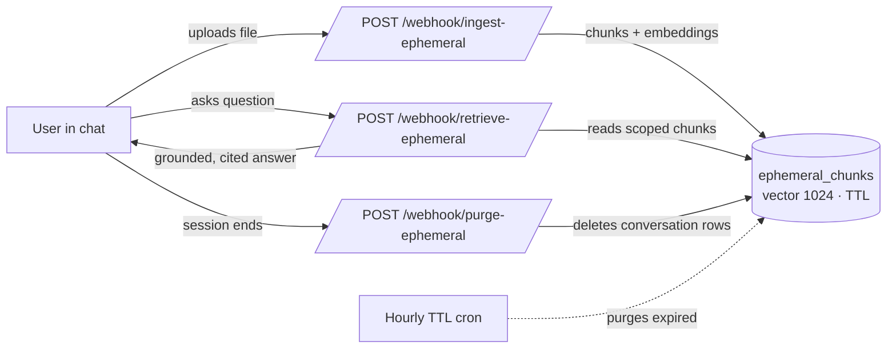
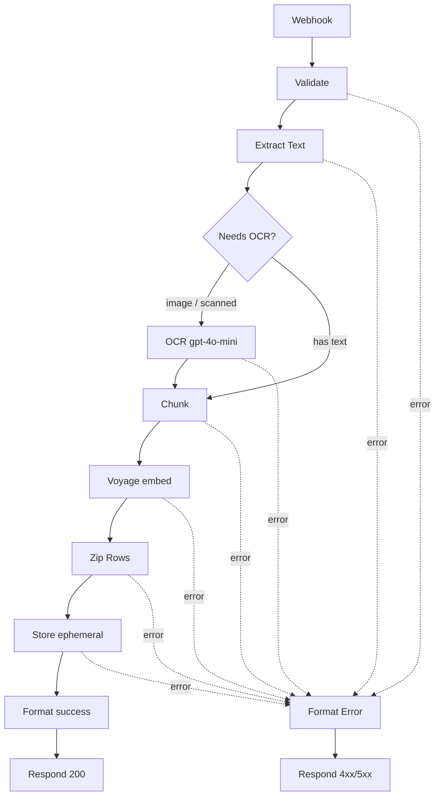
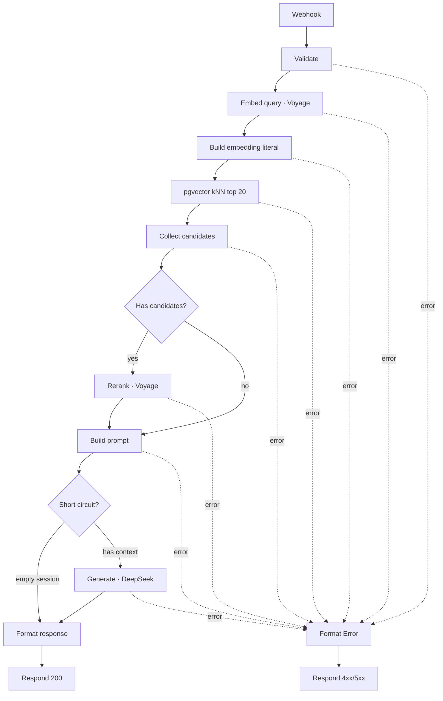
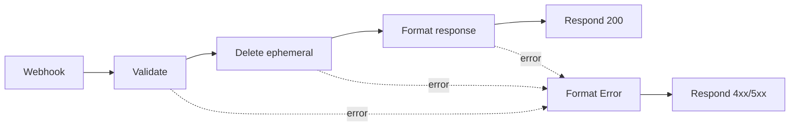

# Ephemeral Workflows — Session-Scoped RAG (Ingest · Retrieve · Purge)

> Conversation-scoped Retrieval-Augmented Generation for the IISc Grounded Agentic
> RAG Platform. A user uploads a document inside a chat session (WhatsApp/web),
> asks questions answered **only** from that document, and the data self-destructs
> on session end or after a TTL. Three n8n workflows implement the full lifecycle.

---

## Table of Contents
1. [Why "ephemeral"? The problem this solves](#1-why-ephemeral)
2. [The session loop at a glance](#2-the-session-loop)
3. [Data model & the `ephemeral_chunks` table](#3-data-model)
4. [The locked model stack (and why each)](#4-model-stack)
5. [Workflow 1 — Ingestion (phase-by-phase)](#5-ingestion)
6. [Workflow 2 — Retrieval (phase-by-phase)](#6-retrieval)
7. [Workflow 3 — Purge (phase-by-phase)](#7-purge)
8. [Cross-cutting techniques & their imperativeness](#8-cross-cutting)
9. [n8n engineering patterns we relied on](#9-n8n-patterns)
10. [Security model](#10-security)
11. [Error taxonomy](#11-errors)
12. [Webhook contracts (quick reference)](#12-contracts)
13. [Deployment & operations](#13-deployment)
14. [Testing & verification](#14-testing)
15. [Known limitations & roadmap](#15-roadmap)

---

<a name="1-why-ephemeral"></a>
## 1. Why "ephemeral"? The problem this solves

The platform has **two upload paths**:

| | Persistent (admin) | **Ephemeral (this doc)** |
|---|---|---|
| Trigger | Admin uploads to the knowledge base | User drops a file mid-chat (WhatsApp/web) |
| Stored in | `document_chunks` (forever) | `ephemeral_chunks` (≤ 1 hour) |
| Visibility | All users in the tenant | **One conversation only** |
| Cleanup | Manual via UI | **Auto: TTL cron + session-end purge** |
| Counts to quota | Yes | No |

**The imperative:** chat users frequently want to ask about a one-off file ("here's
my invoice, what's the total?") without polluting the tenant's permanent knowledge
base or paying storage cost forever. Ephemeral RAG gives them grounded answers
scoped to that single conversation, then cleans up after itself — privacy by
construction (data has a built-in expiry), and cost control (no unbounded growth).

---

<a name="2-the-session-loop"></a>
## 2. The session loop at a glance



Every call is scoped by `tenant_id` **and** `conversation_id`. The same row in
`ephemeral_chunks` is written by Ingestion, read by Retrieval, and deleted by Purge
or the TTL cron.

---

<a name="3-data-model"></a>
## 3. Data model & the `ephemeral_chunks` table

```sql
CREATE TABLE ephemeral_chunks (
  id              UUID PRIMARY KEY DEFAULT gen_random_uuid(),
  tenant_id       UUID NOT NULL REFERENCES tenants(id) ON DELETE CASCADE,
  conversation_id UUID NOT NULL,                 -- scope to one chat
  content         TEXT NOT NULL,
  embedding       vector(1024),                  -- Voyage voyage-4-large
  chunk_index     INTEGER NOT NULL,
  source_name     VARCHAR(500),                  -- original filename
  metadata        JSONB DEFAULT '{}',            -- {used_ocr, page_number}
  expires_at      TIMESTAMPTZ NOT NULL DEFAULT (NOW() + INTERVAL '1 hour'),
  created_at      TIMESTAMPTZ DEFAULT NOW()
);
CREATE INDEX idx_ephemeral_hnsw    ON ephemeral_chunks USING hnsw (embedding vector_cosine_ops) WITH (m=16, ef_construction=64);
CREATE INDEX idx_ephemeral_conv    ON ephemeral_chunks (conversation_id);
CREATE INDEX idx_ephemeral_expires ON ephemeral_chunks (expires_at);
```

**Design concepts and why they matter:**
- **`vector(1024)` + HNSW index** — pgvector stores the embedding; HNSW
  (Hierarchical Navigable Small World) gives sub-linear approximate-nearest-neighbor
  search. *Imperative:* retrieval latency stays low even as chunks accumulate.
  `vector_cosine_ops` matches the `<=>` cosine operator used at query time.
- **`conversation_id` (no FK, indexed)** — deliberately **not** a foreign key so a
  chunk can exist before a formal `conversations` row; indexed for fast scoped reads
  and deletes. *Imperative:* this is the isolation axis for a session.
- **`tenant_id` (FK, NOT NULL)** — the hard multi-tenant gate.
- **`expires_at` (TIMESTAMPTZ, default NOW()+1h)** — the TTL clock, **server-computed**
  (never trust a client timestamp). Indexed so the cron's `WHERE expires_at < NOW()`
  is cheap.
- **`metadata` JSONB** — carries `used_ocr` (cost auditing) and `page_number`
  without schema churn.

---

<a name="4-model-stack"></a>
## 4. The locked model stack (and why each)

| Role | Model | Endpoint | Why this one |
|---|---|---|---|
| Embeddings | **Voyage `voyage-4-large`** (1024-d) | `api.voyageai.com/v1/embeddings` | High-quality retrieval embeddings; free tier; `input_type` distinguishes `document` vs `query` pooling |
| Reranker | **Voyage `rerank-2.5`** | `api.voyageai.com/v1/rerank` | Cross-encoder reranking — precision boost over pure vector scores |
| Generation | **DeepSeek `deepseek-v4-flash`** | `api.deepseek.com/v1/chat/completions` | Cheap, fast, OpenAI-compatible; grounded synthesis |
| OCR / vision | **OpenAI `gpt-4o-mini`** | `api.openai.com/v1/chat/completions` | Reads images **and PDFs directly** (file input) — no local parser/rasterizer needed |
| Self-check (v2) | **Gemini `gemini-3.5-flash`** | `generativelanguage.googleapis.com` | Faithfulness scoring; cheap second opinion (planned) |
| Fallback (v2) | **DeepSeek `deepseek-v4-pro`** | same as Flash | Stronger retry when faithfulness < 0.7 (planned) |

*Imperative:* the stack is **locked** — embeddings must match between ingestion
(`input_type:document`) and retrieval (`input_type:query`) or vector search is
meaningless. The 1024-d width is pinned to the `vector(1024)` column.

---

<a name="5-ingestion"></a>
## 5. Workflow 1 — Ingestion

**File:** `ingest-ephemeral.json` · **Webhook:** `POST /webhook/ingest-ephemeral`
**Nodes:** Webhook → Validate → Extract Text → Needs OCR? → (OCR) → Chunk →
Voyage embed → Zip Rows → Store ephemeral → Format success → Respond; with a
convergent error branch.



### Phase A — Validation (`Validate`, fail-closed gateway)
Techniques:
- **Dual-mode input** — accepts either `file_base64` (bytes in the request, used by
  WhatsApp/remote callers) **or** `file_path` (a file already on the n8n container).
  *Imperative:* the gateway can save to disk OR stream bytes; on a hosted runner
  (Railway) there's no shared volume, so base64 is the practical path.
- **Required-field enforcement** — `conversation_id`, `tenant_id`, `source_name`,
  and one file source. Missing → `422`. *Imperative:* `tenant_id` is the isolation
  gate; never proceed without it.
- **Path-traversal guard** (path mode) — pure-string check rejecting `..` and any
  path not under `/tmp` or `/uploads`. *Imperative:* stops a caller reading
  `/etc/passwd` via the workflow.
- **Size cap** — decoded byte length ≤ 10 MB (`MAX_WHATSAPP_UPLOAD_BYTES`). Rejected
  *before* any expensive parse/embed.
- **TTL bounds** — `ttl_seconds` defaults to 3600, clamped to `[60, 86400]`.

### Phase B — Extraction & OCR (`Extract Text`, `Needs OCR?`, `OCR`)
Techniques:
- **Type inference** from the filename extension (`pdf/docx/txt/png/jpg/jpeg`);
  unsupported → `422`.
- **Lazy module loading** — heavy/builtin modules (`pdf-parse`, `mammoth`,
  `child_process`) are `require()`d **inside the branch that needs them**, so a TXT
  or image request never loads a module it doesn't use. *Imperative:* the hosted
  n8n runtime restricts module access; lazy-loading keeps the common paths working
  even when an optional dependency is unavailable.
- **Multimodal OCR via OpenAI `gpt-4o-mini`** — PDFs and images are sent **directly**
  to the model (PDF as a file part, image as an `image_url`/data-URL), and the model
  returns the text. *Imperative:* this sidesteps fragile local PDF parsing
  (`DOMMatrix`/poppler issues on minimal containers) and handles **scanned**
  documents the same way as digital ones. `metadata.used_ocr = true` is recorded for
  cost auditing.
- **Conditional branch** (`Needs OCR?`) routes only OCR-needing inputs through the
  vision call — text-native TXT skips it (latency + cost saving).

### Phase C — Chunking (`Chunk`)
Techniques:
- **Sliding-window chunking** — 512-word windows with 50-word overlap.
  *Imperative:* overlap preserves context across boundaries so a fact split between
  two windows is still retrievable; window size balances embedding quality vs
  granularity.
- Each chunk carries `chunk_index` (ordering) and optional `page_number`.

### Phase D — Embedding (`Voyage embed`)
- One batched call to Voyage `voyage-4-large` with `input_type: "document"` for all
  chunk texts → 1024-d vectors. *Imperative:* `document` pooling is asymmetric with
  the `query` pooling used at retrieval — using the right type materially improves
  match quality.

### Phase E — Row assembly (`Zip Rows`)
Techniques:
- **Index-aligned zip** — pairs `embeddings[i]` with `chunks[i]`, validates each
  vector is exactly 1024-d, and **explodes to N row items** matching the INSERT's
  `$1..$8` parameter order.
- **pgvector literal encoding** — the float array is serialized to the `[v1,v2,...]`
  string form for the `::vector` cast. *Imperative:* the Postgres node passes
  parameters as text; the literal + cast is the reliable way to bind a vector.

### Phase F — Storage (`Store ephemeral`)
```sql
INSERT INTO ephemeral_chunks
  (tenant_id, conversation_id, content, embedding, chunk_index, source_name, metadata, expires_at)
VALUES ($1, $2, $3, $4::vector, $5, $6, $7::jsonb, NOW() + ($8 || ' seconds')::interval)
RETURNING expires_at;
```
Techniques:
- **Parameterized query** (`$1..$8`) — no string interpolation → **SQL-injection
  safe**.
- **Server-side TTL** — `expires_at = NOW() + ttl_seconds` computed in Postgres, not
  JS. *Imperative:* the database clock is the single source of truth; immune to
  client/timezone skew.
- **`tenant_id` written on every row** (the isolation invariant) and `RETURNING
  expires_at` so the response can report the real expiry.

### Phase G — Response (`Format success` / `Respond`)
Returns `{status:"completed", conversation_id, chunk_count, used_ocr, expires_at}` at
HTTP 200.

---

<a name="6-retrieval"></a>
## 6. Workflow 2 — Retrieval

**File:** `retrieval-ephemeral.json` · **Webhook:** `POST /webhook/retrieve-ephemeral`
A **lean, two-stage RAG** pipeline: embed → ANN search → rerank → grounded generation.



### Phase A — Validation (`Validate`)
- Requires `query`, `tenant_id`, `conversation_id`; `max_chunks` defaults to 5,
  clamped `[1,20]`; `conversation_history` capped to the last 10 turns.
- Sets `candidate_limit = 20` (the ANN fan-out before reranking).

### Phase B — Query embedding (`Embed query`, `Build embedding literal`)
- Voyage `voyage-4-large` with **`input_type: "query"`** (asymmetric with the
  document embeddings). The float array is converted to the `[...]` pgvector literal
  and the kNN params are assembled.

### Phase C — Vector search (`pgvector kNN`, `Collect candidates`, `Has candidates?`)
```sql
SELECT id, content, source_name, chunk_index, metadata,
       1 - (embedding <=> $1::vector) AS score
FROM ephemeral_chunks
WHERE tenant_id = $2 AND conversation_id = $3 AND expires_at > NOW()
ORDER BY embedding <=> $1::vector
LIMIT $4;
```
Techniques & imperatives:
- **Cosine ANN via `<=>`** over the HNSW index; `1 - distance` converts to a 0–1
  similarity score.
- **Triple filter** `tenant_id + conversation_id + expires_at > NOW()` — the heart
  of ephemeral retrieval: only *this* session's *unexpired* chunks for *this* tenant.
  Expired-but-not-yet-purged rows are excluded at read time (defense in depth with
  the cron).
- **`alwaysOutputData` + `Collect candidates`** — a kNN with **zero matches emits
  zero items**, which would dead-end an n8n flow. We force a single output item and
  collapse rows into a `candidates[]` array (possibly empty). *Imperative:* this is
  what makes the graceful "no documents in this session" answer reachable instead of
  a hung/empty response.
- **`Has candidates?` IF** routes empty sessions *around* the reranker (Voyage
  rejects an empty `documents` array) and around the LLM (no wasted call/cost).

### Phase D — Reranking (`Rerank`)
- **Two-stage retrieval**: cheap ANN recall (top 20) → precise cross-encoder rerank
  (Voyage `rerank-2.5`) → top `max_chunks`. *Imperative:* bi-encoder vector scores
  are fast but coarse; the reranker reads query+document **together** and reorders by
  true relevance, sharply improving precision (observed scores rose for on-topic
  queries vs off-topic ones — the basis for a relevance threshold).

### Phase E — Grounded prompt (`Build prompt`, `Short circuit?`)
Techniques & imperatives:
- **Numbered context block** — each chunk is labelled `[1] (source, chunk N)` so the
  model can cite by bracket number. *Imperative:* enables verifiable citations.
- **Grounding system prompt** — instructs the model to answer **only** from the
  numbered context, enumerate **every** item exhaustively (no summarizing/truncation),
  preserve document structure, and **refuse** ("I couldn't find that in the documents
  you uploaded in this session") when the answer is absent. *Imperative:* this is the
  anti-hallucination contract — demonstrated live: "who wrote these rules?" → refusal,
  "how many laws?" → "17 [1]".
- **Short-circuit flag** — empty sessions skip generation entirely and return the
  graceful message.
- **History injection** — prior turns are prepended for multi-turn coherence.

### Phase F — Generation (`Generate · DeepSeek`)
- DeepSeek `deepseek-v4-flash`, `temperature 0.1`, `max_tokens 2048`. Low temperature
  → faithful, stable output; raised token budget → complete answers for "give me all
  details" queries.

### Phase G — Response (`Format response`)
Returns `{answer, sources:[{chunk_text, source_name, chunk_index, score}],
follow_up_questions, faithfulness (null in v1), requires_clarification,
conversation_id, metadata:{model, chunks_retrieved}}`. The `faithfulness` field is
kept for forward-compatibility with the v2 self-check.

---

<a name="7-purge"></a>
## 7. Workflow 3 — Purge

**File:** `purge-ephemeral.json` · **Webhook:** `POST /webhook/purge-ephemeral`
The **session-end signal** → immediate, conversation-scoped deletion.



### Phases
- **Validate** — requires `conversation_id` + `tenant_id`; optional shared-secret
  `token` (a destructive endpoint should be authenticated). Missing → `422`,
  bad token → `401`.
- **Delete** —
  ```sql
  DELETE FROM ephemeral_chunks
  WHERE tenant_id = $1 AND conversation_id = $2
  RETURNING id;
  ```
  *Imperative:* **`tenant_id` in the WHERE is mandatory** — without it, a caller
  could purge another tenant's session. `alwaysOutputData` makes a 0-row delete still
  flow through (idempotent).
- **Format** — `{status:"purged", conversation_id, deleted_count}`. `deleted_count:0`
  is a valid, idempotent success (purging an already-empty session is fine).

**Two-layer deletion strategy:** the purge webhook (immediate, on session end) +
the hourly `cleanup_expired_ephemeral_chunks()` TTL cron (safety net for sessions
that never send an end signal). *Imperative:* belt-and-suspenders — data never
outlives its purpose even if the client forgets to purge.

---

<a name="8-cross-cutting"></a>
## 8. Cross-cutting techniques & their imperativeness

| Technique | Where | Why it's imperative |
|---|---|---|
| **Multi-tenant isolation** | every SQL filters `tenant_id` | Hard data-segregation gate; a leaked row across tenants is a security incident |
| **Conversation scoping** | `conversation_id` on read/write/delete | Keeps one user's uploaded file invisible to other chats |
| **Ephemerality (TTL + purge)** | `expires_at`, cron, purge webhook | Privacy-by-construction + cost control; data self-destructs |
| **Two-stage retrieval** | ANN (top 20) → rerank (top 5) | Recall *and* precision without scanning everything with an expensive model |
| **Asymmetric embeddings** | `input_type` document vs query | Materially better matches; must be consistent across ingest/retrieve |
| **Grounded generation + citations** | retrieval system prompt | Anti-hallucination; every claim traceable to a chunk |
| **Multimodal OCR** | OpenAI file/vision | Handles scanned PDFs & images uniformly |
| **Server-side TTL** | `NOW() + ttl` in Postgres | DB clock is authoritative; immune to client skew |
| **Fail-closed validation** | each `Validate` node | Reject bad/oversized/unsafe input before spending compute |
| **Parameterized SQL** | all Postgres nodes | SQL-injection safe by construction |

---

<a name="9-n8n-patterns"></a>
## 9. n8n engineering patterns we relied on

These are non-obvious n8n-specific techniques that make the workflows robust:

1. **`responseMode: responseNode`** — the webhook holds the HTTP connection so a
   downstream `Respond to Webhook` node returns the real result synchronously.
2. **Convergent error handling** — every Function/HTTP/Postgres node sets
   `onError: "continueErrorOutput"`; all error outputs fan into a single
   `Format Error` node that classifies the failure (phase/node/status) and a single
   `Respond (failure)` returns it. *Imperative:* one consistent error contract
   instead of per-node ad-hoc handling.
3. **`alwaysOutputData: true`** on the kNN and Delete Postgres nodes — n8n skips
   downstream nodes when a node emits 0 items; this forces a single empty item so the
   "no results / 0 deleted" paths still execute. *(The single most important fix for
   correct empty-session behavior.)*
4. **Cross-node passthrough by name** — Function nodes read upstream values via
   `$('Node Name').first().json` instead of relying on the version-fragile "Include
   Input Fields" toggle on HTTP nodes. *Imperative:* context survives HTTP hops
   deterministically.
5. **`queryReplacement` as an array expression** — `={{ [$json.a, $json.b, ...] }}`
   with `$1..$N` placeholders and `::vector`/`::jsonb` casts. *Imperative:* the
   embedding literal contains commas, so a comma-string replacement would break — an
   array binds correctly.
6. **Lazy `require()`** — load optional/native modules only inside the branch that
   uses them, to survive a restrictive `NODE_FUNCTION_ALLOW_*` runtime.
7. **Webhook re-registration** — after editing an *active* workflow via the API, a
   **deactivate → reactivate** cycle is required for the production webhook to pick up
   new node code. *(A real gotcha we hit: saved changes that "didn't take" until
   re-registration.)*

---

<a name="10-security"></a>
## 10. Security model

- **Tenant isolation** enforced in SQL on every read, write, and delete.
- **Path-traversal guard** + `/tmp`,`/uploads` allow-list (ingestion path mode).
- **Size caps** (10 MB) reject oversized payloads before processing.
- **Parameterized SQL** everywhere — no injection surface.
- **Credentials in the n8n vault** — API keys (Voyage/OpenAI/DeepSeek) and the
  Postgres DSN are bound by credential reference; **no secrets in the workflow JSON**
  (committed files use `REPLACE_ME` placeholders).
- **Destructive-endpoint auth** — purge supports a shared-secret `token`
  (placeholder `__PURGE_TOKEN__`); enable before exposing publicly.
- **OCR cost auditing** — `metadata.used_ocr` flags every paid vision call.

---

<a name="11-errors"></a>
## 11. Error taxonomy

Every failure returns a structured body so callers (and humans) can react precisely:
```json
{ "status":"failed", "phase":"validation", "node":"Validate",
  "errorType":"validation", "statusCode":422, "error":"Missing required field: tenant_id",
  "conversation_id":"...", "timestamp":"..." }
```
- **`phase`** — `validation | extraction | chunking | embedding | rerank |
  generation | retrieval | storage | purge | auth | runtime | unknown`.
- **`statusCode`** — **422** for validation (bad input the caller must fix) vs
  **5xx** for runtime (server/provider failure), with **401** for a bad purge token.
- Classification is by error-message signature in the `Format Error` node, since all
  errors converge there.

---

<a name="12-contracts"></a>
## 12. Webhook contracts (quick reference)

**Ingest** — `POST /webhook/ingest-ephemeral`
```json
{ "conversation_id":"uuid","tenant_id":"uuid","source_name":"file.pdf",
  "file_base64":"<bytes>",            // OR "file_path":"/tmp/..."
  "ttl_seconds":3600 }
→ { "status":"completed","chunk_count":8,"used_ocr":true,"expires_at":"...Z" }
```

**Retrieve** — `POST /webhook/retrieve-ephemeral`
```json
{ "query":"...","tenant_id":"uuid","conversation_id":"uuid",
  "max_chunks":5,"conversation_history":[{"role":"user","content":"..."}] }
→ { "answer":"... [1]","sources":[{"chunk_text":"...","source_name":"...","chunk_index":0,"score":0.94}],
    "follow_up_questions":[...],"faithfulness":null,"conversation_id":"uuid",
    "metadata":{"model":"deepseek-v4-flash","chunks_retrieved":4} }
```

**Purge** — `POST /webhook/purge-ephemeral`
```json
{ "conversation_id":"uuid","tenant_id":"uuid","token":"<optional>" }
→ { "status":"purged","conversation_id":"uuid","deleted_count":3 }
```

---

<a name="13-deployment"></a>
## 13. Deployment & operations

- **Import** each JSON into n8n; **bind credentials** (Voyage, OpenAI, DeepSeek as
  header/bearer auth; Postgres) — imports show `REPLACE_ME` placeholders that must be
  rebound.
- **Environment** — Function nodes that use native/external modules need
  `NODE_FUNCTION_ALLOW_BUILTIN` / `NODE_FUNCTION_ALLOW_EXTERNAL` set on the n8n
  container (the OCR-via-OpenAI design minimizes this need for PDFs).
- **Activate**, then if edited via API, **deactivate → reactivate** to re-register
  the production webhook.
- **TTL cron** — schedule `SELECT cleanup_expired_ephemeral_chunks();` hourly
  (`backend/scripts/cleanup_ephemeral.py`).

---

<a name="14-testing"></a>
## 14. Testing & verification

Verified end-to-end in production across **33 cases** (all green after reconciling a
transient burst-load blip):
- **Ingestion (16):** TXT / image-OCR / PDF-OCR happy paths; edges — missing fields,
  no-file, 0-byte base64, unsupported type, ttl out-of-range/non-integer,
  path-traversal, missing file, oversize > 10 MB, TTL math.
- **Retrieval (10):** grounded cited answers, correct `source_name`, empty-session
  graceful answer, cross-tenant isolation; edges — missing fields, `max_chunks`
  bounds/type.
- **Purge (7):** correct-tenant delete, wrong-tenant deletes nothing (data survives),
  idempotent re-purge, post-purge empty retrieve; edges — missing fields.

Real-document demo: ingested the soccer *Laws of the Game* PDF → answered "17 laws
[1]", a full Law-12 breakdown synthesized from multiple chunks `[2][3]`, and
correctly **refused** an unanswerable question — proving grounding.

---

<a name="15-roadmap"></a>
## 15. Known limitations & roadmap

| Item | Status / plan |
|---|---|
| `follow_up_questions` sometimes `[]` | Switch DeepSeek to JSON-mode structured output |
| `faithfulness` is `null` | **v2:** add Gemini self-check + DeepSeek-Pro retry (drop-in between Generate and Format response) |
| No relevance threshold | Treat top rerank score `< ~0.3` as "no good match" → graceful refusal |
| Query not history-aware | Add a query-condensation step (rewrite follow-ups into standalone queries) |
| Naive word-window chunking | Move to structure/recursive chunking; store `page_number` |
| Vector-only recall | Add hybrid (keyword + vector) retrieval before rerank |
| PDF OCR completeness varies | Pin `max_tokens` / page handling for deterministic coverage |
| Purge unauthenticated by default | Enable `__PURGE_TOKEN__` before public exposure |
| No automated eval | RAGAS harness (faithfulness / context-precision) — M10 |

---

*Workflows: `ingest-ephemeral.json` (M5), `retrieval-ephemeral.json` &
`purge-ephemeral.json` (M6). Model stack and webhook contracts are locked — see
`ARCHITECTURE.md` §6 and `specs/MODULE_SPEC_M5.md` / `MODULE_SPEC_M6.md`.*
